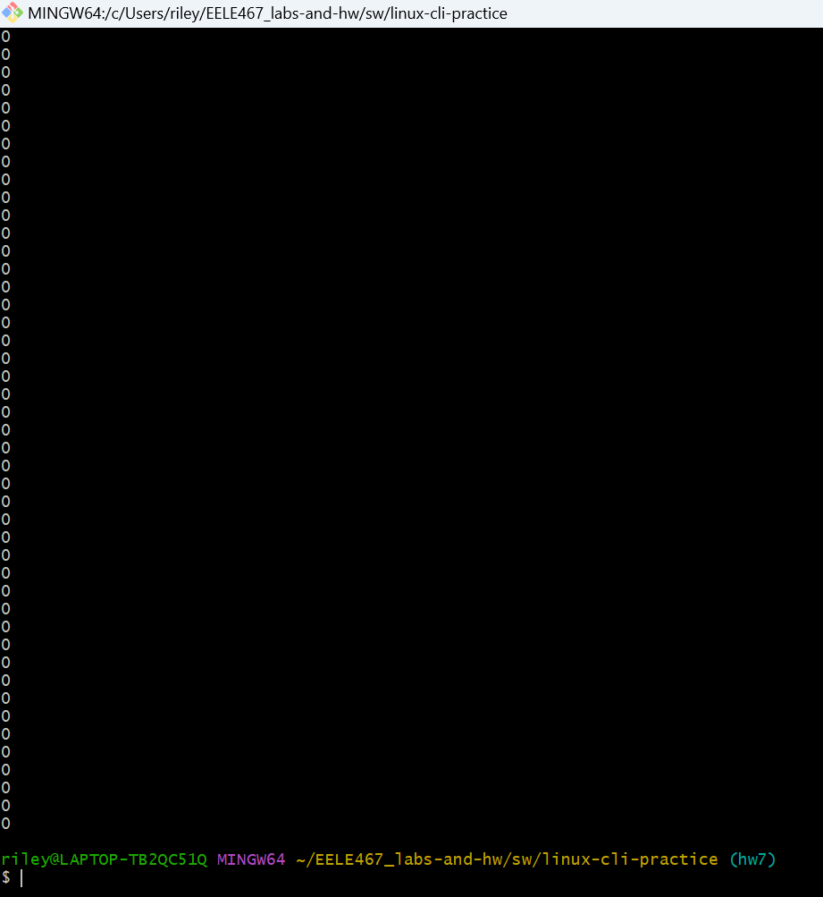
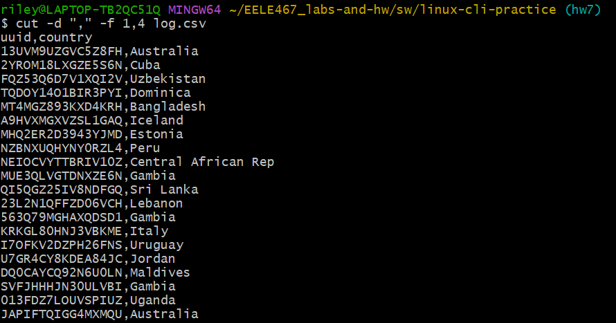
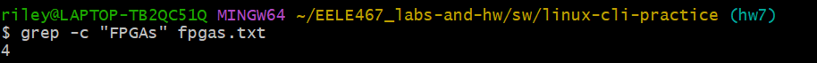

# Hw7 - Riley Holmes

## Overview
This hw is to get practice with linux command line. 

## Counting

### Problem 1
Lorem-ipsum.txt has 296 words 

### Problem 2
Lorem-ipsum.txt has 2089 characters 

### Problem 3
Lorem-ipsum.txt has 20 lines

## Sorting

### Problem 4

There is so much data in this file, it doesnt let me scroll up far enough to see the start, but the command I used was:

sort -h file-sizes.txt

The ending of the function shows this:

### Problem 5

There is so much data in this file, it doesnt let me scroll up far enough to see the start, but the command I used was:

sort -hr file-sizes.txt

The ending of the function shows this:

## Cutting

### Problem 6

Return the ip address column from log.csv.

### Problem 7

Return the timestamp and ip address columns from log.csv.

### Problem 8

Return the uuid and country columns from log.csv.

## Heads or Tails

### Problem 9

Print out first 3 lines of gibberish.txt

### Problem 10

Print out last 2 lines of gibberish.txt

### Problem 11

Print out all but the head of log.csv

## Search for patterns

### Problem 12

Search for "and" in gibberish.txt

### Problem 13

Display each occurance of "we" and display line number

### Problem 14

Display each occurance of "to *word*" 

### Problem 15

Number of occurences of "FPGAs" 

### Problem 16

Print rhyming lines

### Problem 17

I couldnt figure it out.

### Problem 18

redirect output of ls to file. 

in the file

### Problem 19

I got no idea what dmesg is, its not running on gitbash or the WSL in command. 

### Problem 20

Count how many VHDL files are in hdl/.

### Problem 21

I couldnt figure it out.

### Problem 22

print line numbers where "FPGAs" shows up in fpgas.txt

### Problem 23

print 3 largest directories

