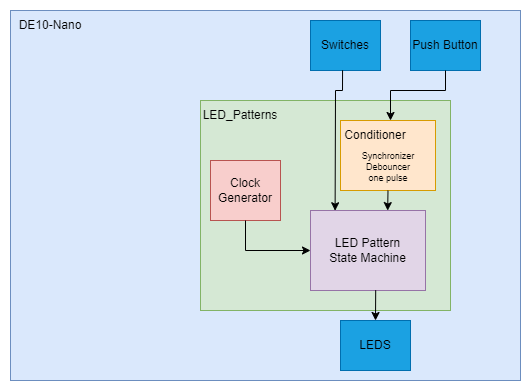
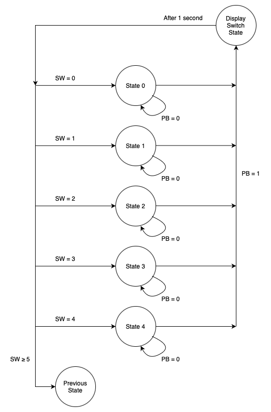

# lab4 - Riley Holmes

## Overview
Lab 4 consists of a pattern generator with 5 patterns of different clock rates. This was also tied to a push button with a conditioner.

### A - functional requirements

1. LED 7 must blink at a rate of 1 * base_period(1 sec) regardless of what the state machine is doing.
2. LEDs 6-0 must be controlled by a state machine with 5 states showing different patterns at different rates.
    1. state 0 : bit shifting right at 1/2 * base_period
    2. state 1 : 2 bits shifting left at 1/4 * base_period
    3. state 2 : 7 bit binary up counter at 2 * base_period
    4. state 3 : 7 bit binary down counter at 1/8 * base_period
    5. state 4 : checker pattern stwitching at 1/5 * base_period - self defined
3. Push button, with conditoner, to show switch state for 1 second

## System Architecture
;
Clock Generator - in charge of creating the clock for each individual pattern.
Conditioner - synchronizes, debounces, and creates a one pulse for the push button. This is all to make sure the push button works correctly.
LED patterns - takes in the clocks from Clock Generator and controls the 5 patterns
State Machine - controls the state of the system, specifically takes in the switches and push button, and determines what led pattern to output.

;
This is my state diagram for lab4, showing all the states and conditions used to operate the system.

## Implementation Details
Pattern 4 is self defined, meaning I created whatever pattern I wanted. I chose a checkers pattern to opperate on a clock signal of 1/5 * base_period.

Pattern - "1010101"
          "0101010"  - after 1/5 sec
          "1010101"  - after 1/5 sec
