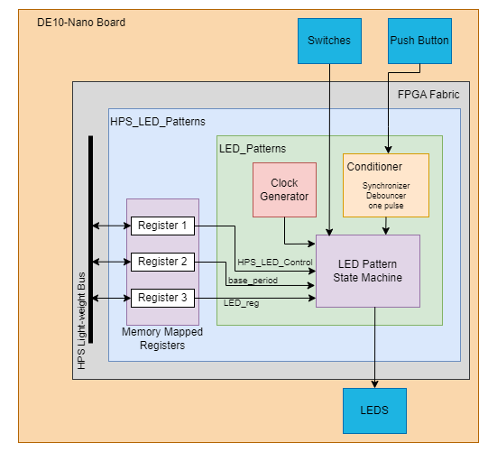
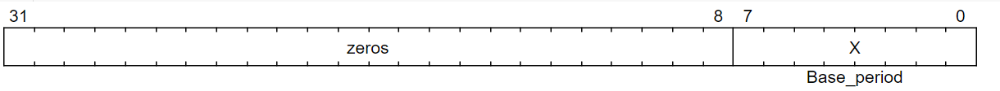
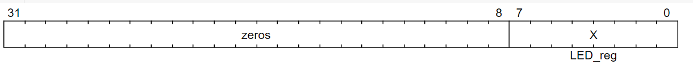

# lab6 - Riley Holmes

## Overview
Lab 6 consists of adding HPS bus functionality to 3 control registers that hold HPS_Led_control, base_period, and LED_reg. These are all used in the led patterns project we made in lab 4.

## System Architecture
;

### New this lab:
Memory Mapped Registers - hold values of HPS_Led_control, base_period, and LED_reg.
HPS Light-Weight Bus - writes and reads to the memory mapped registers to be control from our computer.

### From Last Labs
Clock Generator - in charge of creating the clock for each individual pattern.
Conditioner - synchronizes, debounces, and creates a one pulse for the push button. This is all to make sure the push button works correctly.
LED patterns - takes in the clocks from Clock Generator and controls the 5 patterns
State Machine - controls the state of the system, specifically takes in the switches and push button, and determines what led pattern to output.

## Register Map
HPS_control_LED

Base_period

LED_reg

## Platfrom Designer
These registers are connected to the ARM CPU's by the HPS light-weight bus. 
HPS_Control_Led avs_address => "00"
Base_period     avs_address => "01"
LED_reg         avs_address => "10"